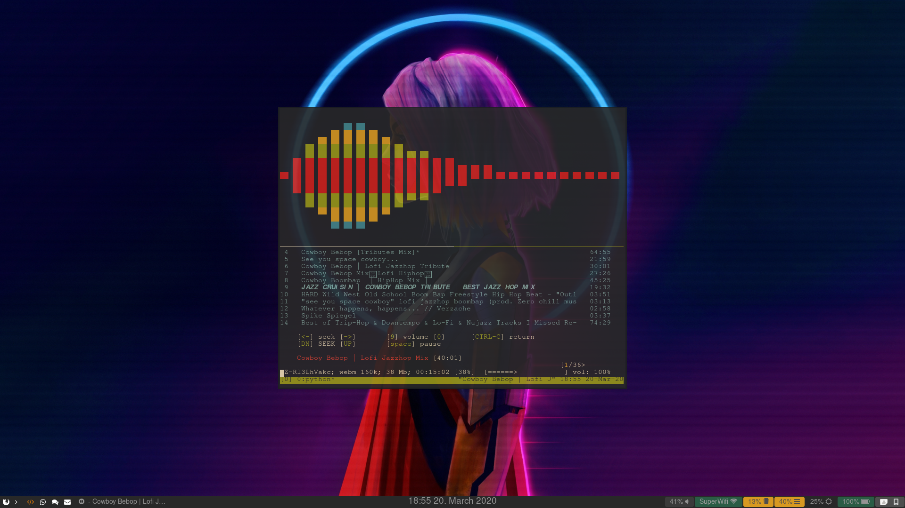

# SwayScripts
Repo of usefull scripts for Sway Window Manager

## Selectively mute notification for certain app with dunst

This python script edit dunst config file in order to mute some apps.
It requires both rofi and dunst.

## Add a sound visualiser to mps-youtube and use it as overlay

This script launch tmux in a new termite window. This tmux will be split in two panes. One holds vis (cli sound visualiser), while the other holds mps-youtube (youtube client).
Then the termite windows is set as floating.
If you run the script again it will send it in the scratchpad.
Run it again and the window is re-invoked from the scratchpad.

You can easily use the bindsym commande in sway config file to run this script with a shortcut.

