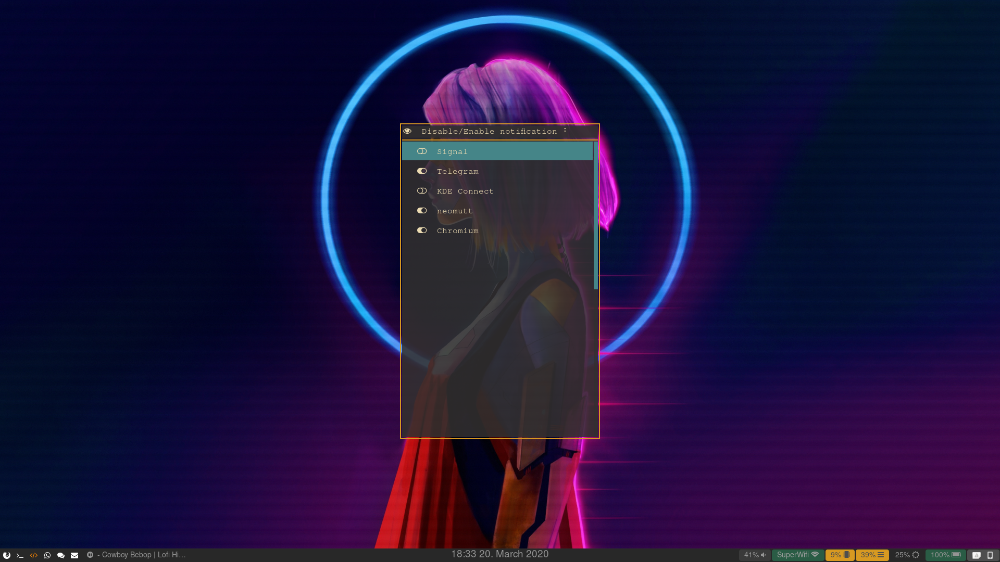

# SwayScripts
Repo of usefull scripts for Sway Window Manager

## Selectively mute notification for certain app with dunst

This python script edit dunst config file in order to mute some apps.
It requires both rofi and dunst.

